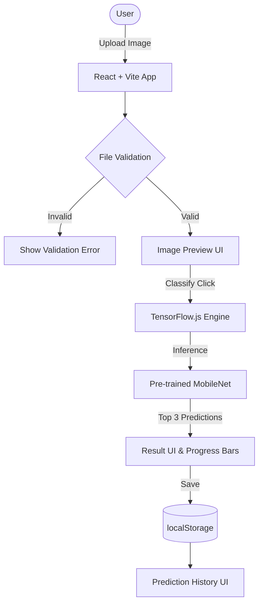

# AI Image Classification Application

A practical, browser-based **AI Image Classification Web Application** built using **React**, **Vite**, **TensorFlow.js**, and the pre-trained **MobileNet** model.

The application performs real-time image classification entirely in the browser without backend dependencies, Python servers, or paid AI APIs.

---

## 📌 Problem Statement

Traditional image classification workflows rely on cloud AI APIs or server-side ML models. This introduces API costs, network latency, server bandwidth consumption, and privacy concerns.

**Solution:** This application loads MobileNet directly into the browser. Once the model is initialized, image classification runs locally on the user's device with zero recurring API costs and complete data privacy.

---

## ✨ Features

- **In-Browser Classification**: Runs real pre-trained MobileNet inference via TensorFlow.js.
- **Drag & Drop Upload**: Supports dragging and dropping or browsing images (`JPG`, `JPEG`, `PNG`, `WEBP`).
- **File Validation**: Restricts uploads to supported image types and a 5 MB maximum file size.
- **Image Preview**: Displays selected image preview, filename, file size, and remove button.
- **Top Category & Confidence**: Displays the top predicted class name and confidence percentage formatted to 2 decimal places.
- **Top 3 Predictions**: Renders progress bars for the top 3 candidate predictions.
- **Low Confidence Warning**: Flags predictions under 50% confidence to inform the user.
- **Prediction History**: Persists predictions and thumbnails in `localStorage` under `image_classifier_history`.
- **Single Model Loading**: Loads MobileNet once and reuses the cached model instance across classifications.
- **Responsive & Accessible UI**: Clean layout that works on desktop, tablet, and mobile browsers.

---

## 🛠️ Technology Stack

- **Framework**: React + Vite
- **Language**: JavaScript (ES6+)
- **Machine Learning**: TensorFlow.js (`@tensorflow/tfjs`)
- **Model**: MobileNet v2 (`@tensorflow-models/mobilenet`)
- **Storage**: Browser `localStorage`
- **Styling**: Vanilla CSS

---

## 🧠 Why MobileNet?

MobileNet is a lightweight Convolutional Neural Network (CNN) designed for mobile and browser environments. It uses depthwise separable convolutions to maintain high accuracy while keeping model parameter size small (~16 MB) and inference speeds fast on client devices.

---

## 🔒 Why Browser-Based Inference?

1. **Zero API Cost**: No subscription or cloud infrastructure fees.
2. **Privacy**: User images stay strictly on their local machine.
3. **Offline & Low Latency**: After initial model loading, inference runs locally without network delay.

---

## 📐 Architecture



---

## 🚀 Installation & Setup

### Prerequisites
- Node.js (v18+)
- npm (v9+)

### Installation
```bash
npm install
```

### Running Locally
```bash
npm run dev
```
Open `http://localhost:3000` in your browser.

### Production Build
```bash
npm run build
```

### Preview Production Build
```bash
npm run preview
```

---

## 🌐 Deployment on Vercel

Since inference is 100% client-side, the app requires no backend server.

1. Push code to GitHub.
2. Import project into [Vercel](https://vercel.com).
3. Select **Vite** preset (Build: `npm run build`, Output: `dist`).
4. Click **Deploy**.

---

## ⚠️ Limitations

- MobileNet is limited to its 1,000 pre-trained ImageNet categories.
- High confidence scores indicate model probability, not absolute correctness.
- Complex or unusual images may produce low-confidence results.
- Hardware capabilities affect inference speed.

---

## 🔮 Future Improvements

- Add support for custom model uploads (fine-tuned models).
- Add multi-object detection (bounding boxes).
- Allow exporting history to JSON/CSV.
