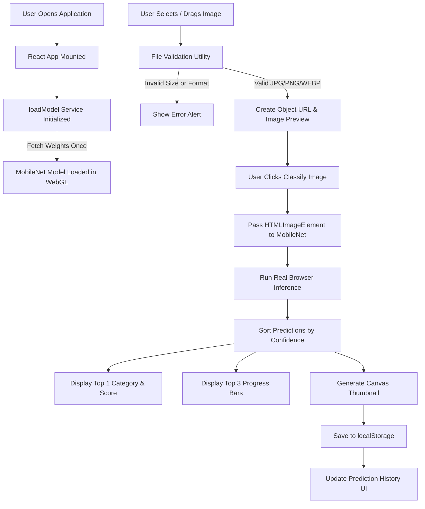

# AI Image Classification Web Application

A complete, client-side **AI Image Classification Web Application** built with **React**, **Vite**, **TensorFlow.js**, and the pre-trained **MobileNet v2** neural network.

The application performs real-time artificial intelligence inference directly inside the user's browser without reliance on external backend servers, Python microservices, or paid AI APIs.

---

## 📌 Problem Statement

Traditional image classification workflows rely on sending heavy images to remote servers or cloud AI APIs (e.g. AWS Rekognition, Google Cloud Vision, OpenAI Vision), incurring API cost, latency overhead, network bandwidth consumption, and potential user privacy concerns.

**Solution:** This application downloads and initializes a lightweight pre-trained neural network (MobileNet v2) into browser memory using WebGL acceleration. Once loaded, image classification occurs locally, instantly, and with zero recurring API costs or server resource consumption.

---

## ✨ Key Features

- 🖼️ **Client-Side AI Inference**: Executes real MobileNet v2 neural network predictions directly in browser WebGL memory.
- 🎯 **Top Category & Confidence**: Displays the top predicted category along with its exact probability percentage (formatted to 2 decimal places).
- 📊 **Top 3 Predictions**: Renders a visual breakdown of the top 3 candidate predictions with animated CSS progress bars proportional to confidence scores.
- ⚠️ **Low-Confidence Warning**: Automatically flags predictions with less than 50% confidence to alert the user about potential ambiguity.
- 📁 **File Validation**: Enforces strict MIME type checks (`image/jpeg`, `image/png`, `image/webp`) and size limits (max 5 MB) before processing.
- 👁️ **Image Preview & Meta**: Shows uploaded image preview, file name, formatted file size, and clean removal option.
- 💾 **Persistent Prediction History**: Stores previous predictions and generated image thumbnails in `localStorage` under `image_classifier_history`.
- 🔄 **Single Model Initialization**: Loads MobileNet weights once on application boot and reuses the cached model across subsequent classifications.
- 📱 **Responsive & Modern UI**: Built with a sleek dark design system, accessible controls, and responsive 2-column layout for Desktop, Tablet, and Mobile.

### 🌟 Bonus Features Implemented
- 🎯 **Drag and Drop Zone**: Drag-and-drop file upload with visual highlight feedback on `dragenter` and `dragover`.
- 📑 **Multiple Image Upload**: Select multiple images at once, browse thumbnails via tab selector, and classify images sequentially.

---

## 🛠️ Tech Stack

| Component | Technology | Rationale |
| :--- | :--- | :--- |
| **Frontend Framework** | React 18 / Vite 6 | Fast HMR, component modularity, lightweight bundling |
| **AI / Machine Learning** | TensorFlow.js (`@tensorflow/tfjs`) | JavaScript ML engine utilizing WebGL GPU acceleration |
| **Pre-trained Model** | `@tensorflow-models/mobilenet` | Compact CNN trained on ImageNet (1000 categories) |
| **Styling** | Vanilla CSS | CSS variables, Flexbox, Grid, custom micro-animations |
| **Icons** | Lucide React | Lightweight SVG icons |
| **Data Persistence** | Browser `localStorage` | Storage key `image_classifier_history` with canvas thumbnail generation |

---

## 🧠 Why MobileNet?

MobileNet was specifically chosen for this browser-based application because:
1. **Lightweight Architecture**: Designed specifically for mobile and web browsers using depthwise separable convolutions to drastically reduce parameters and model binary size (~16 MB).
2. **WebGL Accelerated**: Executes inference directly on the client's GPU via TensorFlow.js WebGL backend.
3. **Pre-trained on ImageNet**: Out-of-the-box recognition of 1,000 everyday object classes (animals, vehicles, instruments, electronics, household items).
4. **Zero Cost & Open Source**: Apache 2.0 license, requiring no subscription, API key, or backend backend infrastructure.

---

## 📐 Application Architecture



---

## 🔄 Complete Application Flow

1. **App Mount**: `App.jsx` triggers `loadModel()` in `src/services/classifier.js`.
2. **Model State**: Header status pill updates to `AI Model Ready`.
3. **File Selection**: User drops or selects image(s) -> `validateImageFile()` validates format (JPG, PNG, WEBP) and size (≤ 5MB).
4. **Preview**: Image is displayed with filename, file size, and "Classify Image" button. Memory Object URL created.
5. **Classification**: Clicking "Classify Image" calls `classifyImage(imgElement)`. MobileNet runs neural inference on pixels.
6. **Result Rendering**: Top 1 prediction and Top 3 probability distribution bars rendered in UI.
7. **Storage**: `createThumbnail()` creates a tiny base64 thumbnail; prediction details are saved to `localStorage` under `image_classifier_history`.

---

## 🚀 Installation & Local Development

### Prerequisites
- Node.js `v18.0.0` or higher
- npm `v9.0.0` or higher

### Steps

1. **Clone or Navigate to Project Directory**
   ```bash
   cd "c:/Users/ADMIN/Desktop/mobzway/AI Image Classification"
   ```

2. **Install Dependencies**
   ```bash
   npm install
   ```

3. **Start Development Server**
   ```bash
   npm run dev
   ```
   Open `http://localhost:3000` in your browser.

4. **Build for Production**
   ```bash
   npm run build
   ```

5. **Preview Production Build**
   ```bash
   npm run preview
   ```

---

## 🌐 Deployment to Vercel

Since all model inference occurs client-side in the browser, no server runtime or API key configuration is required.

1. Push your repository to GitHub.
2. Log into [Vercel](https://vercel.com) and click **Add New Project**.
3. Import your GitHub repository.
4. Framework Preset will be automatically detected as **Vite**.
5. Keep default settings:
   - Build Command: `npm run build`
   - Output Directory: `dist`
6. Click **Deploy**.

---

## ⚠️ Limitations

1. **Dataset Scope**: MobileNet is trained on ImageNet (1000 categories). It can only recognize classes present in ImageNet.
2. **Confidence vs Correctness**: High confidence scores indicate model certainty, not absolute ground truth correctness.
3. **Unusual Images**: Highly abstract, blurred, or crowded images may yield ambiguous or low-confidence predictions.
4. **Client Device Performance**: Older smartphones or computers with disabled WebGL will fall back to CPU inference, which can take 1–2 seconds longer.

---

## 🔮 Future Improvements

- **Model Upgrades**: Integrate MobileNet v3 or EfficientNet for higher accuracy.
- **Custom Model Fine-tuning**: Allow custom Transfer Learning via TensorFlow.js for domain-specific categories (e.g. medical scans, defect detection).
- **Backend Inference Support**: Add optional FastAPI / PyTorch backend endpoint for high-resolution images or batch server processing.
- **Export History**: Export prediction history to JSON / CSV format.
